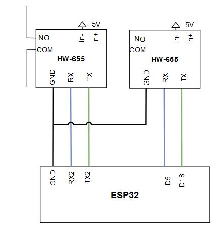

# Module for hw-655 relays

**Manufacturer:**  HONG WEI
**Model:** hw-655
**Module type (code):**  HW-655
**Author:** Adam Snincak

**Datapoints:**

| Datapoint name | Datapoint code | Units | Description |
|:-:|:-:|:-:|:-:|
| Status | STATUS | - | Relay controls the opening and closing of the circuit contacts of an electronic circuit. Possible values: false - open circuit, true - close circuit. Default value is false. |

**Address format:**
* Integer values: 0, 1 or 2
* 0 - Serial 0 (pins TX0 - GPIO1, RX0 - GPIO3)
* 1 - Serial 1 (pins TX1 - GPIO18, RX1 - GPIO5)
* 2 - Serial 2 (pins TX2 - GPIO17, RX2 - GPIO16)

**Connection scheme**
* Use NO and COMM contact terminals for connecting circuit contacts. (normally open circuit)

